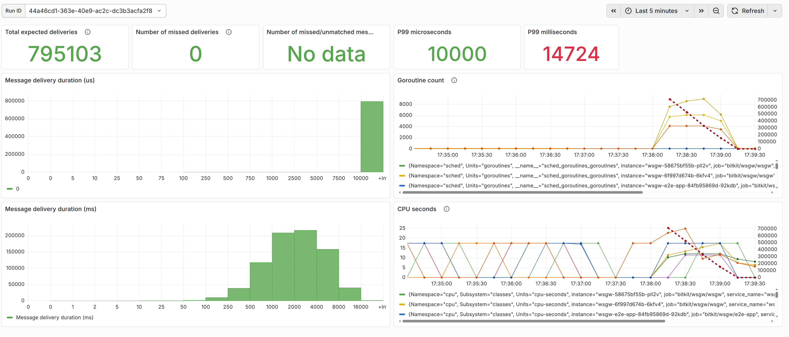
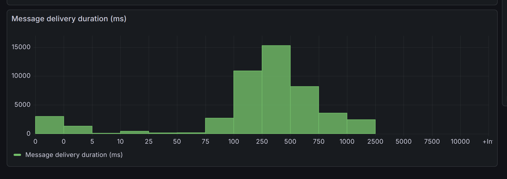
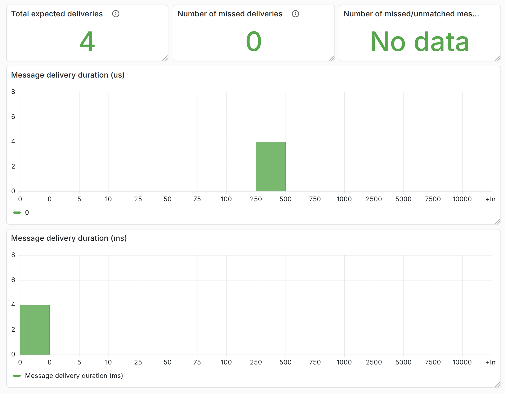
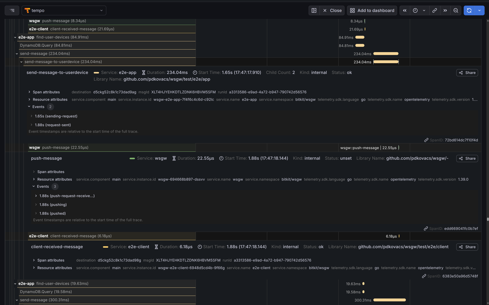

# Single WebSocket Gateway instance

## Manual

### Single test app instance

#### Multiple users with multiple websocket connections each

1. logged in as two distinct users using two WEB-browsers to the test app
2. connected  to WSGW with the same two users with multiple `wscat` instances for each user
3. sent messages (including an incremented number) using a simple WEB-client
4. verified the messages coming in in browser console and in the `wscat` outputs

### Multiple test app instances

#### Single user with a simple WEB-client with a single websocket connection

This is really just for sanity testing the setup of multiple test-app instances

1. logged in with a simple WEB-client
3. sent messages to the logged in user
4. verified the messages coming in in browser console
5. verified looking at metrics in Grafana that incoming message requests
   are distributed evenly over the test application instances

## Automated

### Three test app instances with multiple users with a single websocket connection each

Delivering 

* 128 messages to 12k destinations in total takes about 3 seconds

    ```
    time curl -i -u 'user1:crixcrax1' -X POST 'http://wsgw-e2e-client.internal/run?timeout=5m&user-count=128'
    ```

    

* 256 messages to 47k destinations in total takes about 1 minute 10 seconds

    ```
    time curl -i -u 'user1:crixcrax1' -X POST 'http://wsgw-e2e-client.internal/run?timeout=5m&user-count=256'

    ```

    

Loads having 512 messages to 195k destinations and larger require a large
total number of sockets where the limitations of stress testing on a local
machine with minikube start to show by failures to create connections with
the default range for ephemeral sockets most in the test application.
Increasing the the number of application instances helps. Here are some
results with 16 app instances:

* 512 messages to 193k destinations:



The time spent in WSGW as measured "inside" is still in the order of tens of microseconds.

----

Note

The histograms show durations which start when the test application is very close to having sent the push request
and end when the test client actually receives the message. The durations measurable in the Websocket Gateway are much shorter.
The following sample is fairly representative of the proportions between durations measured "inside" and "outside":



----
