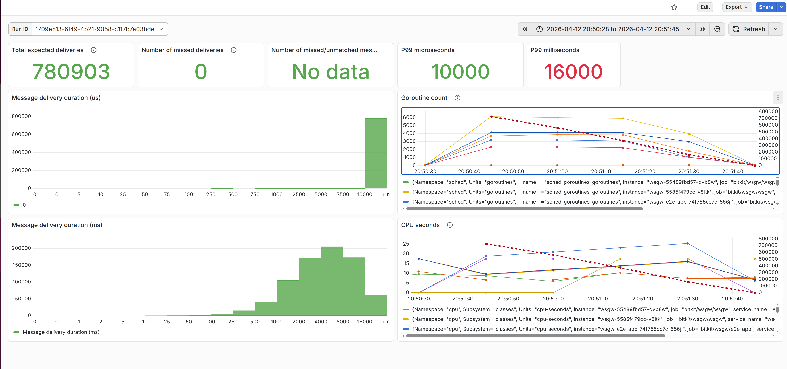
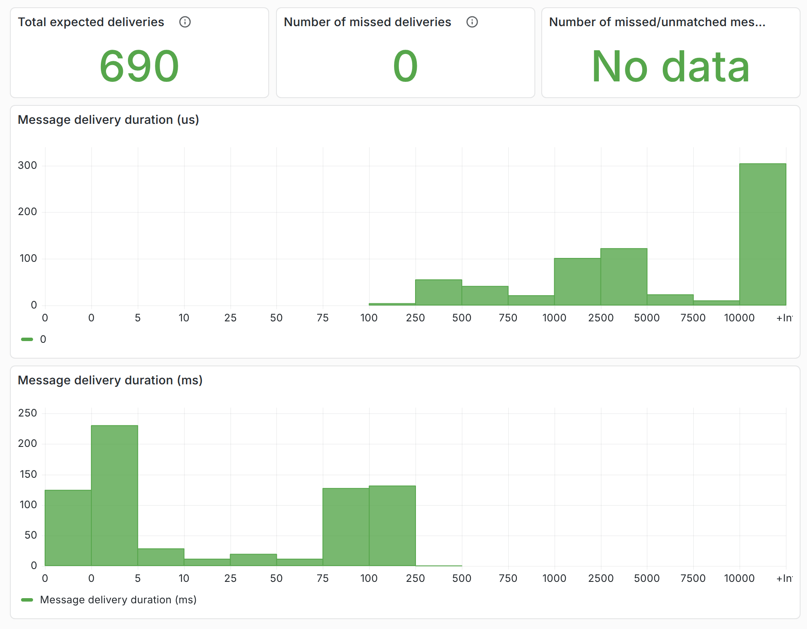

# Single WebSocket Gateway instance

## Manual

### Single test app instance

#### Multiple users with multiple websocket connections each

1. logged in as two distinct users using two WEB-browsers to the test app
2. connected  to WSGW with the same two users with multiple `wscat` instances for each user
3. sent messages (including an incremented number) using a simple WEB-client
4. verified the messages coming in in browser console and in the `wscat` outputs

### Multiple test app instances

#### Single user with a simple WEB-client with a single websocket connection

This is really just for sanity testing the setup of multiple test-app instances

1. logged in with a simple WEB-client
3. sent messages to the logged in user
4. verified the messages coming in in browser console
5. verified looking at metrics in Grafana that incoming message requests
   are distributed evenly over the test application instances

## Automated

### Three test app instances with multiple users with a single websocket connection each

Delivering 

* 128 messages to 12k destinations in total takes about 34 seconds

    ```
    time curl -i -u 'user1:crixcrax1' -X POST 'http://wsgw-e2e-client.internal/run?timeout=5m&user-count=128'
    ```

    

* 256 messages to 49k destinations in total takes about 1 minute 55 seconds

    ```
    time curl -i -u 'user1:crixcrax1' -X POST 'http://wsgw-e2e-client.internal/run?timeout=5m&user-count=256'

    ```

    

While most of the individual deliveries completes in less than 1 second (and the bulk in less than half a second),
which is kind of OK-ish for the targeted use-case,
both test cases create a CPU load of about 15% on a good mid-range CPU (AMD Ryzen AI 7 350),
which looks like "We could do better, couldn't we?". 😐

The delivery time of just a couple of messages are in the microsecond scale (as expected) edging into the millisecond scale
with tens and hundreds deliveries:







----

Note

The histograms show durations which start when the test application is very close to having sent the push request
and end when the test client actually receives the message. The durations measurable in the Websocket Gateway are much shorter.
The following sample is fairly representative of the proportions between durations measured "inside" and "outside":


----
